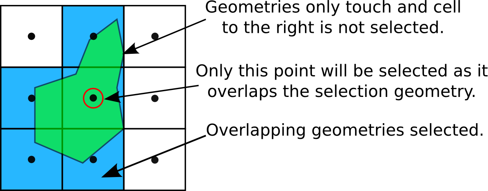
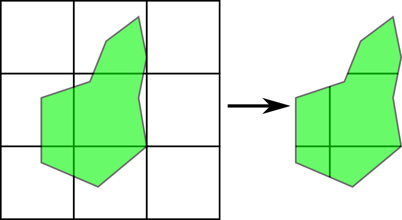
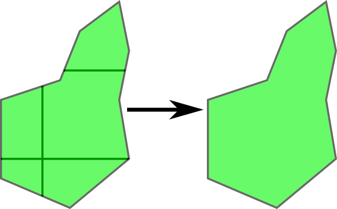

Appendix
--------

Output Formats
~~~~~~~~~~~~~~

Spatial Operations
~~~~~~~~~~~~~~~~~~

.. note:: Differences between point and polygon geometry representations are discussed in the respective sections. The greatest differences between how the geometries are handled occurs in the way point aggregations are constructued (see `Aggregate (Union)`_).

.. _appendix-intersects:

Intersects (Select)
+++++++++++++++++++

Returns ``True`` if the boundary of two spatial objects overlap. This differs from the classical set-theoretic definition of `intersects`_ for spatial analysis. In OpenClimateGIS, geometric objects that `touch`_ only are excluded.

   
   The `intersects` operation returns only overlapping geometries.

.. _appendix-clip:

Clip (Intersection)
+++++++++++++++++++

A clip operation is synonymous with an `intersection`_. If the source data may only be represented as points, then an intersects operation is executed (see `Intersects (Select)`_).

   
   The `clip` operation creates new geometries by cutting features given the boundary of another feature.

.. _appendix-aggregate:

Aggregate (Union)
+++++++++++++++++

Aggregation or union is the merging of feature geometries to create a new geometry. For polygons, this will result in a single features. For points, the result is a multi-point collection.

   
   Multiple polygons are combined into a single polygon during spatial aggregation.

Point Selection Geometries
~~~~~~~~~~~~~~~~~~~~~~~~~~

When selecting data with a point, the point is automatically buffered according to :ref:`search_radius_mult key`. This may result in multiple geometries or cells being returned by a request.

.. _intersects: http://toblerity.org/shapely/manual.html#object.intersects
.. _touches: http://toblerity.org/shapely/manual.html#object.touches
.. _intersect: http://toblerity.org/shapely/manual.html#object.intersects
.. _touch: http://toblerity.org/shapely/manual.html#object.touches
.. _intersection: http://toblerity.org/shapely/manual.html#object.intersection
