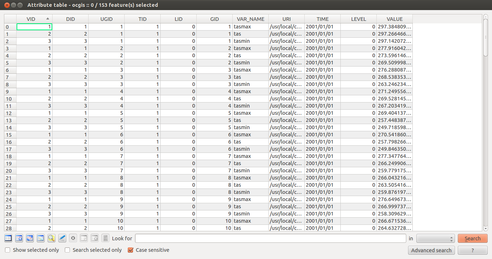
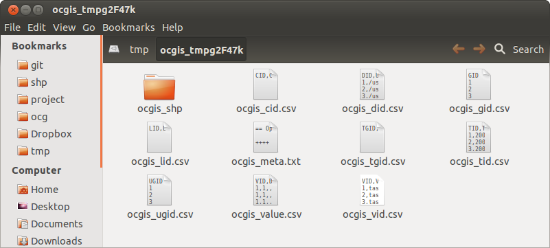
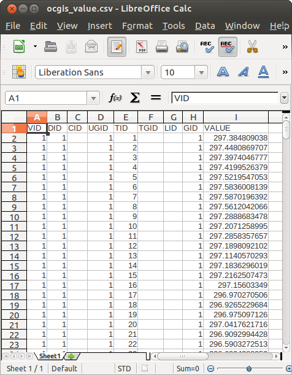
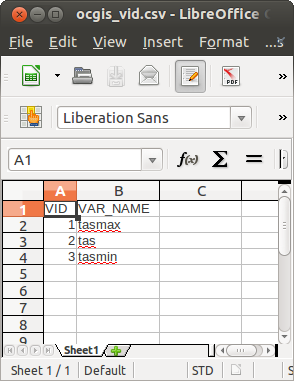

========
Examples
========

These examples will introduce basic subsetting, formatting, and computation in OpenClimateGIS. The datasets used in these examples were downloaded from the Earth System Grid Federation.

.. note:: Shapefile data is currently not distributed with OpenClimateGIS. Please contact the maintainer for information on acquiring shapefile datasets.

Inspection
----------

First, it is always a good idea to ensure a dataset is readable by OpenClimateGIS. Furthermore, it is also good to check if variables/dimensions are properly identifiable and match expectations. The :class:`ocgis.Inspect` object offers a way to perform those initial checks.

.. literalinclude:: sphinx_examples/inspect.py

The second print statement will prepend variable-level information used by OpenClimateGIS. It is important to look carefully at this information to identify any inconsistencies especially if the target dataset may not be entirely CF-compliant. For example, this is normal output for variable-level descriptions:

.. code-block:: rest

   <snip>
   URI = /usr/local/climate_data/CanCM4/tas_day_CanCM4_decadal2000_r2i1p1_20010101-20101231.nc
   VARIABLE = tas
   
   === Temporal =============
   
          Start Date = 2001-01-01 12:00:00
            End Date = 2010-12-31 12:00:00
            Calendar = 365_day
               Units = days since 1850-1-1
   Resolution (Days) = 1
               Count = 3650
          Has Bounds = True
   
   === Spatial ==============
   
   Spatial Reference = WGS84
        Proj4 String = +proj=longlat +datum=WGS84 +no_defs 
              Extent = (-1.40625, -90.0, 358.59375, 90.0)
      Interface Type = SpatialInterfacePolygon
          Resolution = 2.78932702678
               Count = 8192
   
   === Level ================
   
   No level dimension found.
   
   === Dump =================
   
   dimensions:
       time = ISUNLIMITED ; // 3650 currently
       lat = 64 ;
       lon = 128 ;
       bnds = 2 ;
   
   variables:
       float64 time(time) ;
         time:bounds = "time_bnds" ;
         time:units = "days since 1850-1-1" ;
         time:calendar = "365_day" ;
         time:axis = "T" ;
         time:long_name = "time" ;
   </snip>

Use of `snippet`
----------------

The :ref:`snippet_headline` argument is important when testing and developing an OpenClimateGIS call. It should generally be set to `True` until the final data request is ready. This is for your benefit (requests are faster) as well as for the benefit of any remote storage server (not transferring excessive data).

Simple Subsetting
-----------------

.. warning:: The `keyed` :ref:`output_format_headline` is highly recommended as writing data to shapefiles/CSV may result in large file sizes. For each record, a shapefile repeats the geometry storage.

This example will introduce simple subsetting by a bounding box with conversion to in-memory NumPy arrays, shapefile, CSV, and keyed formats.

.. literalinclude:: sphinx_examples/simple_subset.py

Now, the directory structure for `/tmp/foo` will look like (temporary directory names will differ):

.. code-block:: rest

   $ find /tmp/foo
   /tmp/foo
   /tmp/foo/shp_tmplZ_8mU
   /tmp/foo/shp_tmplZ_8mU/shp.shx
   /tmp/foo/shp_tmplZ_8mU/shp_meta.txt
   /tmp/foo/shp_tmplZ_8mU/shp.prj
   /tmp/foo/shp_tmplZ_8mU/shp.dbf
   /tmp/foo/shp_tmplZ_8mU/shp.shp
   /tmp/foo/csv_tmpRL7dwt
   /tmp/foo/csv_tmpRL7dwt/csv.csv
   /tmp/foo/csv_tmpRL7dwt/csv_meta.txt
   /tmp/foo/keyed_tmpE0noqj
   /tmp/foo/keyed_tmpE0noqj/keyed_gid.csv
   /tmp/foo/keyed_tmpE0noqj/keyed_vid.csv
   /tmp/foo/keyed_tmpE0noqj/keyed_ugid.csv
   /tmp/foo/keyed_tmpE0noqj/keyed_lid.csv
   /tmp/foo/keyed_tmpE0noqj/keyed_value.csv
   /tmp/foo/keyed_tmpE0noqj/keyed_meta.txt
   /tmp/foo/keyed_tmpE0noqj/keyed_cid.csv
   /tmp/foo/keyed_tmpE0noqj/keyed_tid.csv
   /tmp/foo/keyed_tmpE0noqj/keyed_did.csv
   /tmp/foo/keyed_tmpE0noqj/keyed_shp
   /tmp/foo/keyed_tmpE0noqj/keyed_shp/keyed_shpidx.dbf
   /tmp/foo/keyed_tmpE0noqj/keyed_shp/keyed_shpidx.shx
   /tmp/foo/keyed_tmpE0noqj/keyed_shp/keyed_shpidx.shp
   /tmp/foo/keyed_tmpE0noqj/keyed_shp/keyed_shpidx.prj
   /tmp/foo/keyed_tmpE0noqj/keyed_tgid.csv

.. note:: This data management approach may be confusing and efforts will be made in future releases to improve directory management.

Advanced Subsetting
-------------------

In this example, a U.S. state boundary shapefile will be used to subset and aggregate three climate datasets. The aggregation will occur on a per-geometry + dataset basis. Hence, we will end up with daily aggregated "statewide" temperatures for the three climate variables. We also want to clip the climate data cells to the boundary of the selection geometry to take advantage of area-weighting and avoid data duplication.

.. literalinclude:: sphinx_examples/advanced_subset.py

The shapefile attribute table would like something like:

   
   An example shapefile output attribute table. Note how repeated elements may lead to large filesizes. This is a good output format when making an initial pass at a data request. Again the `keyed` output is recommended for data requests in general unless writing to NetCDF which is remains the most efficient format.

For the `keyed` output, the output folder will contain a number of CSV files with unique identifiers that may be linked via the `ocgis_value.csv` table. The `ocgis_shp` folder will contain a shapefile representing the data geometries -- perfect for joining.

   Folder contents for the `keyed` output.

   A peak inside the `ocgis_value.csv` file.

   A peak inside the `ocgis_vid.csv` file which links to the `VID` attribute of the value file.

Subsetting with a Time/Level Range
----------------------------------

Adding a time or level range subset is done at the :class:`~ocgis.RequestDataset` level.

.. warning:: Datetime ranges are absolute and inclusive.

For example, the code below will return all data from the year 2000 for the first two levels. Level indexing originates at 1.

>>> from ocgis import OcgOperations, RequestDataset
>>> import datetime
...
>>> ## Depending on your data's time resolution, the hour/minute/second/etc.
>>> ## may be important for capturing all the data within the range.
>>> tr = [datetime.datetime(2000,1,1),datetime.datetime(2000,12,31,23,59,59)]
>>> rd = RequestDataset('/my/leveled/data','tas',time_range=tr,level_range=[1,2])
>>> ret = OcgOperations(dataset=rd).execute()
